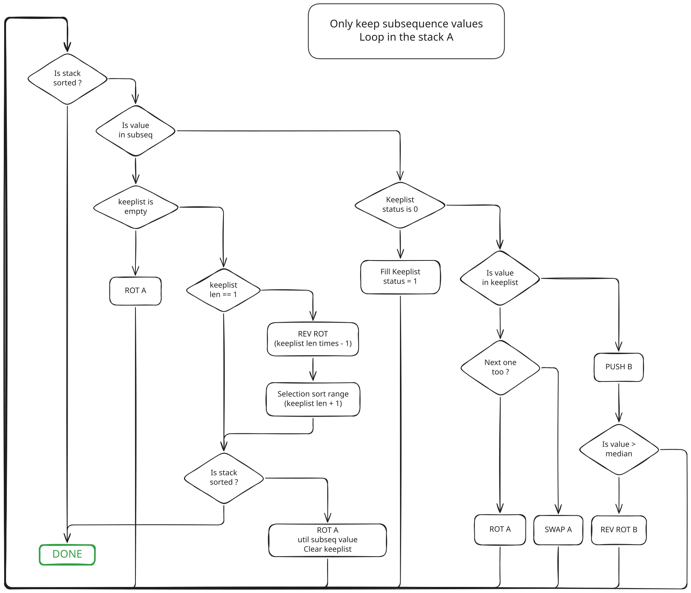
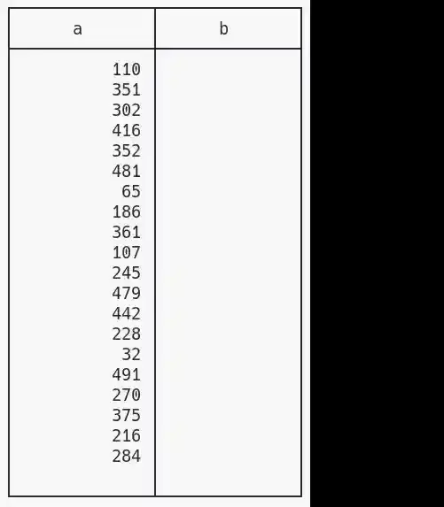

*This project has been created as part of the 42 curriculum by [flinguen](https://linguenheld.net/)*

## 42_push_swap

### Description
The purpose of this project is to discover some algorithms.  
However, since it's a 42 there are some rules which prevent us to use famous algorithms:  
- There are two stacks a & b
- The first one is filled on startup
- The only authorised movements are:
    - sa:  swap the two first elements of a
    - sb:  swap the two first elements of b
    - ss:  swap the two first elements of a & b
    - pa:  push the first element at the top of b at the top of a
    - pb:  the opposite
    - ra:  rotate the stack a of one
    - rb:  rotate the stack b of one
    - rr:  rotate the two stacks at the same time
    - rra: reverse rotate the stack a of one
    - rrb: reverse rotate the stack b of one
    - rrr: reverse rotate the two stacks at the same time
- At the end, all elements have to be sorted increasingly in the stack a
- In less than:
    - 700 commands for 100 elements
    - 5500 commands for 500 elements
- Each command has to be printed

### Usage

Clone the repository with the recursive flag (required for the libft).
``` Bash
    git clone --recursive https://github.com/flinguenheld/42_push_swap
```

Then you can use the Makefile to compile.
``` Bash
    make fclean && make
```

Add launch the executable with some values, it will print the list of commands which can be used to sort the list.
``` Bash
    ./push_swap 5 2 6 8 1
```

E.g. to display the amount of commands:
``` Bash
    ARG="4 67 3 87 23"; ./push_swap $ARG | wc -l
```


### Algorithms

#### Selection sort

Until the last element in A:
- Find the lower value
- Push in in B

Then Push all them back in A.

Easy to write, works great but with a O(n²) complexity, it requires a lot of commands:

```
------------------------- 10 values ----       ------------------------- 20 values ----
 Total: 33                                      Total: 94
    r: 18                                          r: 60
        ra : 13                                        ra : 32
        rb : 0                                         rb : 0
        rra: 5                                         rra: 28
        rrb: 0                                         rrb: 0
        rr : 0                                         rr : 0
        rrr: 0                                         rrr: 0
    p : 14                                         p : 34
        pa : 7                                         pa : 17
        pb : 7                                         pb : 17
    s  : 1                                         s  : 0
        sa : 1                                         sa : 0
        sb : 0                                         sb : 0
        ss : 0                                         ss : 0

------------------------- 100 values ----     ------------------------- 500 values ----
 Total: 1606                                   Total: 32308
    r: 1412                                       r: 31315
        ra : 786                                      ra : 14093
        rb : 0                                        rb : 0
        rra: 626                                      rra: 17222
        rrb: 0                                        rrb: 0
        rr : 0                                        rr : 0
        rrr: 0                                        rrr: 0
    p : 194                                       p : 992
        pa : 97                                       pa : 496
        pb : 97                                       pb : 496
    s  : 0                                        s  : 1
        sa : 0                                        sa : 1
        sb : 0                                        sb : 0
        ss : 0                                        ss : 0
```

#### Group sort

The idea is to push values in b as they are and sort them blocks after blocks.  
Sorting these blocks is more complex because it has to hanv no impact on the other values which are already sorted.  
This alogrithm is better than the previous one but its still too much and it also depends on the block sizes.  

###### groups of 10:
```
------------------------- 10 values ----     ------------------------- 20 values ----
 Total: 22                                    Total: 90
    r: 7                                         r: 38
        ra : 6                                       ra : 17
        rb : 0                                       rb : 10
        rra: 1                                       rra: 5
        rrb: 0                                       rrb: 6
        rr : 0                                       rr : 0
        rrr: 0                                       rrr: 0
    p : 14                                       p : 52
        pa : 7                                       pa : 26
        pb : 7                                       pb : 26
    s  : 1                                       s  : 0
        sa : 1                                       sa : 0
        sb : 0                                       sb : 0
        ss : 0                                       ss : 0

------------------------- 100 values ----     ------------------------- 500 values ----
 Total: 920                                    Total: 13192
    r: 563                                        r: 11318
        ra : 192                                      ra : 4144
        rb : 78                                       rb : 505
        rra: 213                                      rra: 6157
        rrb: 80                                       rrb: 512
        rr : 0                                        rr : 0
        rrr: 0                                        rrr: 0
    p : 356                                       p : 1874
        pa : 178                                      pa : 937
        pb : 178                                      pb : 937
    s  : 1                                        s  : 0
        sa : 1                                        sa : 0
        sb : 0                                        sb : 0
        ss : 0                                        ss : 0
```

###### groups of 40:
```
------------------------- 100 values ----     ------------------------- 500 values ----
 Total: 1071                                   Total: 8228
    r: 720                                        r: 6299
        ra : 51                                       ra : 1521
        rb : 290                                      rb : 1656
        rra: 108                                      rra: 1461
        rrb: 271                                      rrb: 1661
        rr : 0                                        rr : 0
        rrr: 0                                        rrr: 0
    p : 350                                       p : 1928
        pa : 175                                      pa : 964
        pb : 175                                      pb : 964
    s  : 1                                        s  : 1
        sa : 1                                        sa : 1
        sb : 0                                        sb : 0
        ss : 0                                        ss : 0
```

Beyond 40, the amount start to increase, so it's better but still not optimised.

#### Greedy LIS sort

Thanks to my teammates Patrick & Raphaël, I tried another approach:  
 - Push all values from a to b
 - Leave the maximum of sorted values in b
 - Push back values with the minimum of commands

Firstly with the [longest increasing subsequence](https://en.wikipedia.org/wiki/Longest_increasing_subsequence).  
*I chose the [dynamic programming approach](https://www.youtube.com/watch?v=iQP5XFeXiMQ) which looks the easiest to write with linked lists.*  

Once we have this list, we can push in b all other values and finally having a sorted list in a.  
Thanks to that, we can reduce the amount of sorting from 15 to 20%.  
(I expected more -_-') but that's great!  

I tried to increase this amount by keeping values which are close to their last position whith this logic:

<div align="center">
    
</div>

Random laws are heartless though, it can manage some elements but the impact is not relevant.  

The other optimisation is to compute the median value of the list a and divide values in b in two groups.  
That's easy to add and it helps the second part of the algorithm (~200 commands less for 500 elements).

The last step is the greedy part:  
The values left in 'a' are sorted and we have to push back all values from b.  
Before each command, we comptute the price for each b value and choose the cheapest.  
Thanks to that logic, the alogrithm *(is slow -_-, but)* needs less commands.  

```
------------------------- 10 values ----     ------------------------- 20 values ----
 Total: 27                                    Total: 60
    r: 17                                        r: 37
        ra : 5                                       ra : 22
        rb : 4                                       rb : 6
        rra: 7                                       rra: 9
        rrb: 0                                       rrb: 0
        rr : 1                                       rr : 0
        rrr: 0                                       rrr: 0
    p : 10                                       p : 18
        pa : 5                                       pa : 9
        pb : 5                                       pb : 9
    s  : 0                                       s  : 5
        sa : 0                                       sa : 5
        sb : 0                                       sb : 0
        ss : 0                                       ss : 0

------------------------- 100 values ----     ------------------------- 500 values ----
 Total: 528                                    Total: 4315
    r: 364                                        r: 3401
        ra : 116                                      ra : 578
        rb : 75                                       rb : 624
        rra: 81                                       rra: 1050
        rrb: 19                                       rrb: 344
        rr : 51                                       rr : 379
        rrr: 22                                       rrr: 426
    p : 160                                       p : 914
        pa : 80                                       pa : 457
        pb : 80                                       pb : 457
    s  : 4                                        s  : 0
        sa : 4                                        sa : 0
        sb : 0                                        sb : 0
        ss : 0                                        ss : 0
    
```

<div align="center">
    
</div>

Mixed with a selection sort for list shorter than ~12 elements, it's enough to validate the project.

### Checker

The [checker](https://github.com/flinguenheld/42_push_swap/tree/master/bonus) is a program which allows to test your sorting.  
Compile it with the command:

``` Bash
make bonus
```

Display usage:
``` Bash
./checker --help
```

Example:
``` Bash
./checker --verbose 3 5 42
./push_swap 5 2 6 8 1 | ./checker -v 5 2 6 8 1
```

### Tester

You can use the *generate_test* script to launch a serie of tests, it will generate random values to use it with push_swap and
print a summary for 10 to 500 values.  

``` Bash
./generate_test

# Just a test:
./generate_test 100

# A test with the checker & summary
./generate_test debug 50
```
